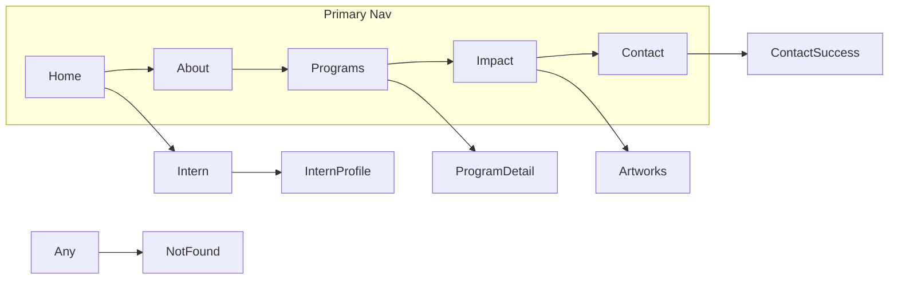

# EchoBloom Figma-to-Code Implementation Plan

## Executive Summary

The [EchoBloom-Website](c:\Users\mikko\Cursor\EchoBloom-Website) repo is **greenfield** (empty `index.html`, no `package.json`, no source tree). The Figma file [**IPMD Work**](https://www.figma.com/design/OR313UKdTDvkkILsbdl8vb/IPMD-Work?node-id=1-7967) is the visual source of truth and contains two pages:

- **EchoBloom Wireframes** (`1:7967`) — 10+ desktop screens at 1440px, shared Header/Footer, marketing content, forms, carousels, and state variants
- **Components** (`1:6105`) — IPMD design system primitives (Button, Input, Alert, Icons, etc.)

The Build Agent will **scaffold** a monorepo-style single repository with:

1. **Frontend:** React 18 + TypeScript + Vite + React Router + Tailwind CSS (token-mapped to Figma variables)
2. **Backend:** Node.js + Express + PostgreSQL (via Prisma) for contact/intern submissions and CV storage
3. **Responsive:** Desktop-first fidelity, with tablet/mobile layouts **derived** from desktop frames at standard breakpoints

No Figma write operations. All assets exported via read-only MCP (`get_design_context`, `get_variable_defs`, `get_metadata`) and committed locally.

---

## Existing Architecture Analysis

| Area | Current state | Implication |
|------|---------------|-------------|
| Frontend | Empty [`index.html`](index.html) | Full Vite/React scaffold required |
| Backend | None | New Express API from scratch |
| Database | None | New Prisma schema |
| Auth | None in design | No login/session work in v1 |
| Components/tokens | None | Build from Figma Components page |
| Tests | None | Add Vitest + Playwright incrementally |
| CI/CD | None | Add in later milestone (optional) |

**Preservation scope:** Keep git remote, `.gitattributes`, and Figma MCP workspace config. Replace empty `index.html` with Vite entry shell.

---

## Figma Inventory (Read-Only Analysis)

### Canonical routes (map duplicate frames to one route + UI states)



| Route | Figma frame | Node ID | Notes |
|-------|-------------|---------|-------|
| `/` | Home | `25:471` | Hero, stats, feature cards, program tabs, intern CTA |
| `/about` | About | `75:1481` | Values, IPMD relationship accordion, video placeholder, team carousel, dark CTA |
| `/programs` | Programs (hub) | `91:702` | Creative Art Sessions, XR Gallery, Inclusive AI cards |
| `/programs/creative-art-sessions` | Programs (detail) | `179:4325` | Session steps, Cards carousel, mini-navbar steps, before/after gallery |
| `/impact` | Impact | `207:6166` | Art Gallery hero, stats (placeholder `X`), expression section |
| `/artworks` | Artworks | `212:6423` | Featured artwork, filter pills, masonry-style grid |
| `/artworks` (alt grid) | Artworks | `239:1394` | Secondary layout state — treat as filtered view variant |
| `/contact` | Programs* | `239:973` | Contact form + social carousel (*frame misnamed) |
| `/contact/success` | Programs* | `239:1168` | Success confirmation state |
| `/intern` | Desktop | `178:3446` | Intern landing + application form + intern carousel |
| `/intern/:slug` | Intern | `207:5873` | Profile detail (example: Abhinav Das) |
| `*` | NotFound | `260:1888` | 404 page |

**Duplicate / state frames to merge (not separate routes):**

- `162:2388` — Contact duplicate of `239:973`
- `260:1894` — Intern form with Alert error state (implement as form validation UI)
- `259:1705`, `239:973` variants — program sub-states; fold into hub/detail components

### Shared layout components (Figma component sets)

| Component | Figma source | Variants |
|-----------|--------------|----------|
| Header | `194:619` | Active nav: Home / About / Programs / Impact / Contact |
| Footer | `216:712` | Static 3-column links + copyright |
| Button | `212:7543` | Size L/S; Type Primary/Secondary/Tertiary/Tertiary Mono; states Default/Hover/Pressed |
| Button Pill | `212:7695` | Same variant matrix |
| Button Icon | `212:7847` | Circular icon buttons (carousel, social) |
| Button Group Pill | `212:7985` | Artwork category filters |
| Input | `212:8135` | Default/Focus/Filled/Error/Disabled |
| Alert | `212:8256` | Info/Warning/Error/Success |
| Row / Accordion | `212:8242`, `207:6130` | IPMD product list on About + Intern pages |
| Icons | `220:1175` | 16/24/32px Remix Icon-based set |
| Cards | `160:2280` (instance) | Program showcase carousel on Home + Programs detail |

### Design tokens (from `get_variable_defs`)

Extract to [`src/styles/tokens.css`](src/styles/tokens.css) and mirror in [`tailwind.config.ts`](tailwind.config.ts):

**Colors**
- Brand: Blue `#0064FF`, Orange `#FF7300`, Yellow `#F5A000`
- Content: Primary `#020617`, Secondary `#334155`, Tertiary `#64748b`, Brand EB `#0064ff`, OnBrand `#ffffff`
- Background: Primary `#ffffff`, Disabled `#f8fafc`, Brand EB `#0064ff`
- Border: Default `#cbd5e1`

**Typography**
- Body: **Inclusive Sans** — 14/16/18px (Regular 400, SemiBold 600)
- Headings: **Archivo** — 18px SemiBold, 40px Bold (H1), 64px Bold (Display)
- Line heights: 22/26/30/52/76px per Figma text styles

**Spacing & radius**
- Spacing: S=8, M=12, L=16, 2XL=32
- Radius: XS=4, S=8, M=12, Pill=999

**Layout constants from frames**
- Max content width: 1280px inside 80px horizontal padding (1440 canvas)
- Header height: 96px; primary button: 200×56px

### Responsive strategy (user choice: derive breakpoints)

Figma has **no structured mobile/tablet frames**; only loose reference images (`235:1768` 880×1600, etc.). Build Agent will derive:

| Breakpoint | Width | Behavior |
|------------|-------|----------|
| Desktop | ≥1280px | Match Figma 1440 layouts (1280 content + 80px gutters) |
| Tablet | 768–1279px | 2-column grids → 1–2 columns; reduce nav gap; stack split sections |
| Mobile | <768px | Single column; hamburger nav using `Icons/16/Menu`; full-width buttons; carousels swipeable |

Use Tailwind `lg:` / `md:` / `sm:` utilities aligned to above, not Figma absolute positioning from MCP reference code.

### Feature classification

| Feature | Type | Backend needed? |
|---------|------|-----------------|
| Marketing pages, nav, footer | Pure frontend | No |
| Program tab switching (Home) | Client state | No |
| Artwork filter pills | Client state (+ optional API later) | Optional |
| Team/intern/social carousels | Client state | No |
| Stats with `X` placeholders | Static content v1 | No (CMS later) |
| Contact form | Form + validation | **Yes** — persist + email notify |
| Intern application + CV upload | Form + file upload | **Yes** — file storage + DB |
| Newsletter / social links | External links v1 | No |
| 404 page | Static route | No |

---

## Recommended Technology Stack

| Layer | Choice | Reasoning |
|-------|--------|-----------|
| UI | React 18 + TypeScript | Matches Figma MCP reference output; strong component model |
| Build | Vite | Fast dev, simple static deploy for frontend |
| Routing | React Router v7 | Multi-page marketing site with nested routes |
| Styling | Tailwind CSS v4 + CSS variables | Token mapping, responsive utilities, MCP class translation |
| Forms (client) | react-hook-form + zod | Matches Input/Alert/HelpText states in Figma |
| Icons | `remixicon` | Figma Components page specifies Remix Icon base set |
| Fonts | `@fontsource/inclusive-sans` + `@fontsource/archivo` | Self-hosted, no FOUT from Google CDN dependency |
| API | Express 4 + TypeScript | User requested custom backend |
| ORM | Prisma + PostgreSQL | Typed schema, migrations, straightforward for forms |
| File storage | Local `uploads/` dev; S3-compatible (e.g. AWS S3 / Cloudflare R2) prod | CV/resume uploads from intern form |
| Validation (server) | zod (shared schemas) | Consistent client/server rules |
| Email | Nodemailer or SendGrid API | Notify team on new submissions |
| Testing | Vitest + RTL (unit); Playwright (e2e + visual QA) | Verify forms and layout fidelity |
| State | React local state + URL search params | No Redux needed for marketing site |

**Explicitly avoid for v1:** Next.js SSR, Redux, CMS, auth providers, GraphQL — unnecessary for current design scope.

---

## Frontend Architecture

### Directory structure

```
EchoBloom-Website/
├── package.json                 # npm workspaces: client + server
├── client/
│   ├── index.html
│   ├── vite.config.ts
│   ├── tailwind.config.ts
│   ├── postcss.config.js
│   ├── tsconfig.json
│   ├── public/assets/           # committed Figma exports
│   └── src/
│       ├── main.tsx
│       ├── App.tsx
│       ├── routes.tsx
│       ├── styles/
│       │   ├── tokens.css
│       │   ├── fonts.css
│       │   └── globals.css
│       ├── components/
│       │   ├── layout/
│       │   │   ├── SiteLayout.tsx
│       │   │   ├── Header.tsx
│       │   │   └── Footer.tsx
│       │   ├── ui/
│       │   │   ├── Button.tsx
│       │   │   ├── ButtonPill.tsx
│       │   │   ├── ButtonIcon.tsx
│       │   │   ├── ButtonGroupPill.tsx
│       │   │   ├── Input.tsx
│       │   │   ├── Textarea.tsx
│       │   │   ├── HelpText.tsx
│       │   │   ├── Alert.tsx
│       │   │   ├── AccordionRow.tsx
│       │   │   └── Icon.tsx
│       │   ├── sections/
│       │   │   ├── HeroSection.tsx
│       │   │   ├── StatsRow.tsx
│       │   │   ├── FeatureCard.tsx
│       │   │   ├── SplitSection.tsx
│       │   │   ├── ProgramShowcase.tsx
│       │   │   ├── CTABanner.tsx
│       │   │   ├── Carousel.tsx
│       │   │   ├── SocialGallery.tsx
│       │   │   └── PageHeroBanner.tsx
│       │   └── forms/
│       │       ├── ContactForm.tsx
│       │       └── InternApplicationForm.tsx
│       ├── pages/
│       │   ├── HomePage.tsx
│       │   ├── AboutPage.tsx
│       │   ├── ProgramsPage.tsx
│       │   ├── ProgramDetailPage.tsx
│       │   ├── ImpactPage.tsx
│       │   ├── ArtworksPage.tsx
│       │   ├── ContactPage.tsx
│       │   ├── ContactSuccessPage.tsx
│       │   ├── InternPage.tsx
│       │   ├── InternProfilePage.tsx
│       │   └── NotFoundPage.tsx
│       ├── data/
│       │   ├── navigation.ts
│       │   ├── home.ts
│       │   ├── programs.ts
│       │   ├── impact.ts
│       │   ├── artworks.ts
│       │   ├── team.ts
│       │   └── interns.ts
│       ├── lib/
│       │   ├── apiClient.ts
│       │   └── schemas.ts
│       └── hooks/
│           ├── useCarousel.ts
│           └── useActiveRoute.ts
└── server/
    ├── package.json
    ├── tsconfig.json
    ├── src/
    │   ├── index.ts
    │   ├── app.ts
    │   ├── routes/
    │   │   ├── contact.routes.ts
    │   │   └── intern.routes.ts
    │   ├── controllers/
    │   │   ├── contact.controller.ts
    │   │   └── intern.controller.ts
    │   ├── services/
    │   │   ├── contact.service.ts
    │   │   ├── intern.service.ts
    │   │   ├── email.service.ts
    │   │   └── storage.service.ts
    │   ├── middleware/
    │   │   ├── errorHandler.ts
    │   │   ├── validateRequest.ts
    │   │   └── upload.ts
    │   └── config/
    │       └── env.ts
    └── prisma/
        └── schema.prisma
```

### Key component contracts

**Header** — props: `activeRoute: 'home' | 'about' | 'programs' | 'impact' | 'contact'`
- Desktop: logo + 5 nav links + "Get Involved" primary button
- Mobile: logo + menu button → slide-down nav drawer
- Uses React Router `<NavLink>` with Figma active color (`content-brand-eb`)

**Button** — props: `variant`, `size`, `children`, `asChild?`, `disabled?`, `type?`
- Implement hover/pressed via Tailwind `hover:` / `active:` matching Figma states
- Never hardcode absolute widths in pages; use `className` overrides for full-width mobile

**ContactForm** — fields from Figma `239:973`:
- First name, Last name, Email, Organization, Role/interest (select), Message (textarea)
- Client validation → `POST /api/contact`
- Error state renders Figma `Alert` component inline
- Success navigates to `/contact/success`

**InternApplicationForm** — fields from Figma `178:3446`:
- Personal info rows, education, portfolio links, cover letter, CV file upload
- File input triggers `multipart/form-data` → `POST /api/intern/applications`
- Show Alert on upload/validation errors (`260:1894` reference)

**Carousel** — props: `items`, `visibleCount`, `renderItem`
- Used by: Meet the Team, Meet our Interns, social image strip, Cards program showcase
- Keyboard accessible: arrow buttons map to Figma Button Icon left/right

### Page-to-section mapping (Home example)

| Section | Component | Figma node |
|---------|-----------|------------|
| Hero | `HeroSection` | `183:533` |
| Stats | `StatsRow` | `194:1052` |
| Mission split | `SplitSection` | `194:1053` |
| 3 feature cards | `FeatureCard` ×3 | `188:697` |
| Program tabs | `ProgramShowcase` | `215:512` + `160:2280` |
| Intern CTA | `SplitSection` | `215:517` |

---

## Backend Architecture

### API endpoints

**POST `/api/contact`**

Request:
```json
{
  "firstName": "string",
  "lastName": "string",
  "email": "string",
  "organization": "string?",
  "roleInterest": "string?",
  "message": "string"
}
```

Response `201`:
```json
{ "id": "uuid", "status": "received" }
```

Errors: `400` validation, `429` rate limit, `500` server

**POST `/api/intern/applications`** (multipart)

Fields: same as form + `resume` file (pdf/doc/docx, max 5MB)

Response `201`:
```json
{ "id": "uuid", "status": "submitted" }
```

**GET `/api/health`** — `{ "ok": true }` for deployment checks

No public GET endpoints for submissions (admin out of scope v1).

### Middleware stack

1. `helmet` — security headers
2. `cors` — allow client origin from env
3. `express.json()` — JSON routes
4. `multer` — file upload (intern route only)
5. `validateRequest(zodSchema)` — shared schemas with client
6. `rateLimit` — 5 req/min per IP on POST routes
7. `errorHandler` — consistent JSON errors

### Database schema (Prisma)

```prisma
model ContactSubmission {
  id             String   @id @default(uuid())
  firstName      String
  lastName       String
  email          String
  organization   String?
  roleInterest   String?
  message        String
  createdAt      DateTime @default(now())
}

model InternApplication {
  id             String   @id @default(uuid())
  firstName      String
  lastName       String
  email          String
  phone          String?
  university     String?
  major          String?
  graduationYear String?
  portfolioUrl   String?
  linkedinUrl    String?
  coverLetter    String?
  resumeUrl      String
  resumeFileName String
  createdAt      DateTime @default(now())
}
```

Adjust field list after Build Agent pulls exact labels from `get_design_context` on `178:3446`.

### Security requirements

- Server-side zod validation on all fields
- Sanitize text fields; store raw message as text only
- File upload: whitelist MIME types, scan filename, randomize stored name, never execute uploads
- Rate limiting + honeypot field on forms (bot mitigation)
- Env secrets via `.env` (never commit): `DATABASE_URL`, `SMTP_*`, `AWS_*`, `CLIENT_ORIGIN`
- HTTPS assumed in production reverse proxy

---

## Asset Management

1. For each page/section, call `get_design_context` on the target Figma node (read-only)
2. Download all MCP asset URLs (`https://www.figma.com/api/mcp/asset/...`) into `client/public/assets/{page}/`
3. Rename descriptively: `hero-home.jpg`, `logo.svg`, `feature-neurodivergent.jpg`
4. Use `` with explicit width/height containers per figma-design-to-code skill — **never hand-draw SVG icons**; use exported assets or `remixicon` where glyph matches
5. Add `scripts/export-figma-assets.mjs` to re-fetch before release (assets expire ~7 days)

---

## Accessibility Requirements

- Semantic landmarks: `<header>`, `<main>`, `<footer>`, `<nav>`
- Skip-to-content link
- All interactive elements keyboard focusable with visible focus rings (match Figma Input Focus state)
- Form labels tied to inputs; errors announced via `aria-live="polite"` on Alert
- Carousel: `aria-roledescription="carousel"`, prev/next `aria-label`
- Color contrast: verify `#64748b` on white meets WCAG AA for body text
- Reduced motion: respect `prefers-reduced-motion` for carousels
- Mobile menu: focus trap when open, `aria-expanded` on menu button

---

## Implementation Milestones

### M1 — Project scaffold and design foundation
**Depends on:** nothing

**Create:**
- Root `package.json` with npm workspaces (`client`, `server`)
- Full client Vite/React/TS/Tailwind scaffold
- `client/src/styles/tokens.css`, `fonts.css`, `globals.css`
- `client/tailwind.config.ts` mapping Figma tokens
- `server/` Express + TS + Prisma skeleton
- `.env.example` for both apps
- Update root [`index.html`](index.html) → `client/index.html`

**Modify:** root [`index.html`](index.html) (move/replace)

**Result:** `npm run dev` serves client; `npm run dev:server` serves API health check

**Risks:** Font loading mismatch — verify Inclusive Sans/Archivo weights match Figma

---

### M2 — UI component library (Figma Components page)
**Depends on:** M1

**Create:** All files under `client/src/components/ui/`

**Process:** For each component set in Figma page `1:6105`, call `get_design_context` on representative symbol nodes:
- Button: `212:7544`
- Input: `212:8136`
- Alert: `212:8257`
- Button Icon: `212:7848`
- Accordion row: `207:6130`

**Result:** Story-less but visually complete primitives with variant props

**Risks:** Hover/pressed states may need manual Tailwind tuning beyond MCP output

---

### M3 — Layout shell, routing, and static content model
**Depends on:** M2

**Create:**
- `SiteLayout`, `Header`, `Footer` from nodes `194:618`, `216:712`
- `client/src/routes.tsx` with all routes
- `client/src/data/navigation.ts` + placeholder page shells
- `client/src/lib/apiClient.ts`

**Result:** Navigable site with header/footer on all routes; active nav state matches Figma variants

---

### M4 — Home page (highest visibility)
**Depends on:** M3

**Create:** `HomePage.tsx` + section components

**Figma source:** `get_design_context` on `25:471`

**Interactions:** Program tab buttons switch Cards showcase content client-side

**Result:** Pixel-close desktop Home; basic responsive stacking

---

### M5 — About + Impact pages
**Depends on:** M4 (reuse sections)

**Create:** `AboutPage.tsx`, `ImpactPage.tsx`, `AccordionRow`, `CTABanner`, `Carousel`

**Figma sources:** `75:1481`, `207:6166`

**Result:** Team carousel functional; IPMD accordion list rendered from data

---

### M6 — Programs hub + Creative Art Sessions detail
**Depends on:** M5

**Create:** `ProgramsPage.tsx`, `ProgramDetailPage.tsx`, `ProgramShowcase`, program data files

**Figma sources:** `91:702`, `179:4325`

**Result:** Program detail mini-navbar steps scroll/navigate sections

---

### M7 — Artworks gallery
**Depends on:** M6

**Create:** `ArtworksPage.tsx`, `ButtonGroupPill` filters, masonry grid

**Figma sources:** `212:6423`, `239:1394`

**Result:** Filter pills toggle visible artwork categories client-side

---

### M8 — Backend: database, contact API, intern API
**Depends on:** M1 (can parallelize after M3)

**Create:**
- Prisma schema + migration
- Contact + intern routes/controllers/services
- Multer upload + storage service
- Email notification on submission
- `ContactForm.tsx`, `InternApplicationForm.tsx` wired to API

**Figma sources:** `239:973`, `239:1168`, `178:3446`, `260:1894`

**Result:** Real form persistence; success redirect to `/contact/success`

**Risks:** CV storage path permissions; email deliverability in dev

---

### M9 — Intern pages + 404
**Depends on:** M8

**Create:** `InternPage.tsx`, `InternProfilePage.tsx`, `NotFoundPage.tsx`

**Figma sources:** `178:3446`, `207:5873`, `260:1888`

---

### M10 — Responsive polish (tablet + mobile)
**Depends on:** M4–M9

**Modify:** All section components with Tailwind responsive classes

**Breakpoints:** mobile `<768`, tablet `768–1279`, desktop `≥1280`

**Result:** Hamburger nav, stacked forms, swipe-friendly carousels

---

### M11 — Testing and visual QA
**Depends on:** M10

**Create:**
- Vitest tests for Button, Input, form validation schemas
- Playwright e2e: nav, contact submission happy path, intern form validation errors
- Visual QA checklist comparing each route to Figma screenshots at 1440/768/375 widths

**Visual QA process:**
1. Run app at each breakpoint
2. Side-by-side with Figma frames (same node IDs as above)
3. Verify: layout, spacing (80px gutters, 1280 content), typography scale, colors, button sizes, image aspect ratios, header/footer consistency
4. Log discrepancies in a `VISUAL_QA.md` file for sign-off

---

## Files to Create (summary)

**Client (~45 files):** scaffold configs, 11 pages, ~15 UI components, ~10 section components, 2 forms, data files, hooks, styles, asset folders

**Server (~15 files):** Express app, 2 route modules, 2 controllers, 4 services, middleware, Prisma schema, env config

**Root:** `package.json`, `.env.example`, optional `README.md` (only if user requests)

## Files to Modify

- [`index.html`](index.html) — replace/move to Vite client entry
- Optionally track [`.cursor/settings.json`](.cursor/settings.json) (currently untracked)

---

## Assumptions and Unresolved Questions

1. **Stats placeholders:** Impact/Artworks frames show `X` for metrics — v1 uses static placeholder numbers from Home (`50+`, `1,000`, etc.) until client provides real data
2. **Program sub-routes:** Only Creative Art Sessions gets a dedicated detail page in v1; other program CTAs link to sections on `/programs` unless client specifies more routes
3. **Video placeholder:** About page gray video block is a clickable placeholder — no embedded video URL in Figma
4. **Intern profiles:** Only one profile frame (`207:5873`); additional interns come from `client/src/data/interns.ts`
5. **Deployment target:** Not specified — plan assumes frontend static build + API on Node host (Railway, Render, VPS). Build Agent should add `client/vite.config.ts` proxy to API in dev
6. **Email provider:** SendGrid/SMTP credentials required in `.env` before forms are production-ready
7. **Production file storage:** S3/R2 bucket required for CV uploads outside local dev

---

## Build Agent Handoff Instructions

1. **Read Figma read-only first:** For each milestone, call `get_design_context` with `skillNames: "figma-design-to-code"` on the listed node IDs before writing page code. Treat output as reference — convert absolute Tailwind to project components/tokens.
2. **Never write to Figma.** No `use_figma`, `generate_figma_design`, or file mutations.
3. **Scaffold monorepo** per directory structure above; preserve git history.
4. **Implement M1→M11 in order**; M8 can start after M3 in parallel with M4–M7.
5. **Download and commit all image assets** from MCP URLs during implementation.
6. **Map all Figma CSS variables** to `tokens.css` — do not hardcode hex in components except in token definitions.
7. **Use Remix Icon** for UI icons where Figma specifies; use exported assets for brand logo and photography.
8. **Wire forms to Express API** with shared zod schemas; intern form uses multipart upload.
9. **Derive responsive layouts** at 768/1280 breakpoints; implement mobile hamburger nav.
10. **Finish with M11 visual QA** against Figma frames; document any intentional deviations.
11. **Do not commit** `.env`, uploaded files, or `.cursor/settings.json` unless user asks.
